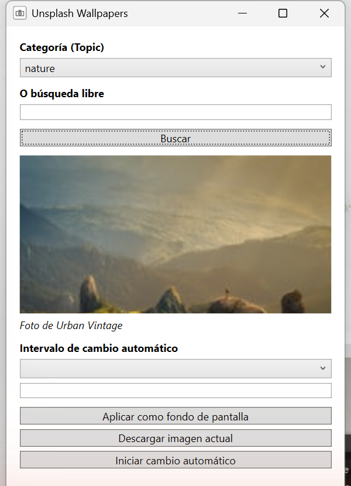
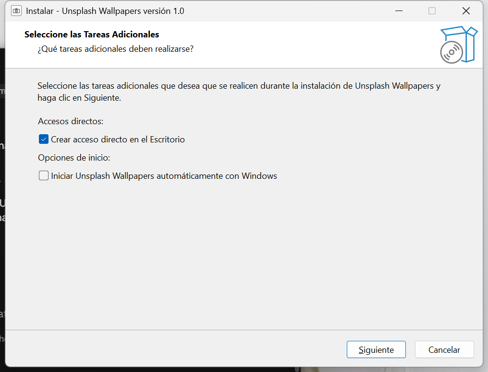
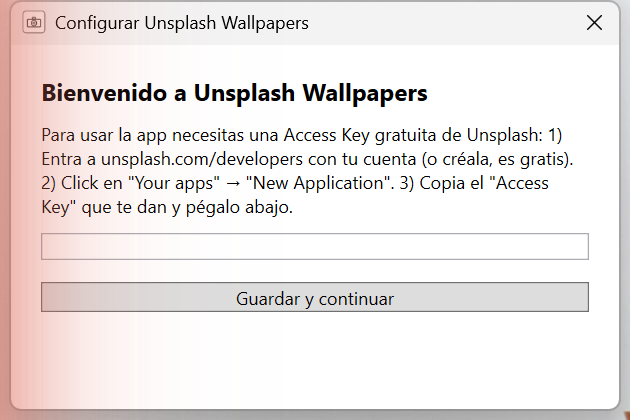
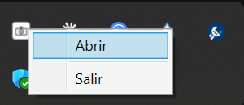

# Unsplash Wallpapers para Windows

Una app de escritorio que cambia tu fondo de pantalla usando fotos de [Unsplash](https://unsplash.com), inspirada en [Unsplash Wallpapers de Mac](https://apps.apple.com/es/app/unsplash-wallpapers/id1284863847?mt=12). Corre en la bandeja del sistema, sin ocupar espacio en tu barra de tareas.

## Características

- Búsqueda por categorías predefinidas (naturaleza, viajes, arquitectura, minimalismo, animales) o por palabra clave libre
- Vista previa de la foto y crédito del fotógrafo antes de aplicarla
- Cambio automático del fondo de pantalla por intervalo (30 min / 1h / 3h / 6h / diario / personalizado)
- Descarga de la imagen actual a tu carpeta de Imágenes
- Ícono en la bandeja del sistema con menú de acceso rápido (Abrir / Salir)

## Instalación

1. Ve a la sección [Releases](../../releases) de este repositorio.
2. Descarga el archivo `UnsplashWallpapersSetup.exe` de la última versión.
3. Ejecútalo y sigue el asistente de instalación.

Durante la instalación puedes elegir:
- Crear un acceso directo en el Escritorio
- Iniciar la app automáticamente junto con Windows

## Primer uso: configurar tu Access Key de Unsplash

La app necesita una **Access Key gratuita** de Unsplash para poder buscar y descargar fotos. Cada persona debe usar la suya propia (es gratis y toma 2 minutos):

1. Entra a [unsplash.com/developers](https://unsplash.com/developers) con tu cuenta de Unsplash (o crea una, es gratis).
2. Click en **"Your apps"** → **"New Application"**.
3. Acepta los términos de uso, dale un nombre a tu aplicación (ej. "Mis Wallpapers") y una descripción corta.
4. Copia el **Access Key** que te generan.

Al abrir la app por primera vez, te pedirá pegar esa key:

Pégala y presiona **Guardar y continuar**. No necesitas volver a hacer esto — queda guardada en tu equipo.

## Cómo usar la app

1. **Elige una categoría** del menú desplegable, o escribe una palabra en el campo de búsqueda libre (ej. "montañas", "minimalista").
2. Click en **Buscar** para ver una foto de muestra.
3. Click en **Aplicar como fondo de pantalla** para usarla de inmediato, o en **Descargar imagen actual** para guardarla sin aplicarla.
4. Para que el fondo cambie solo, elige un intervalo en **Intervalo de cambio automático** y presiona **Iniciar cambio automático**.

## Ícono en la bandeja del sistema

La app queda corriendo en segundo plano. Búscala junto al reloj de Windows (puede estar oculta bajo la flechita `^` de "mostrar íconos ocultos").

- **Click izquierdo**: abre la ventana principal
- **Click derecho → Abrir**: lo mismo
- **Click derecho → Salir**: cierra la app por completo

## Desinstalar

Ve a Configuración → Aplicaciones → busca "Unsplash Wallpapers" → Desinstalar. También puedes usar el acceso directo que Inno Setup crea en el Menú Inicio.

## Créditos

Fotos proporcionadas por [Unsplash](https://unsplash.com), bajo su [licencia de uso](https://unsplash.com/license). Esta aplicación no está afiliada oficialmente a Unsplash.
